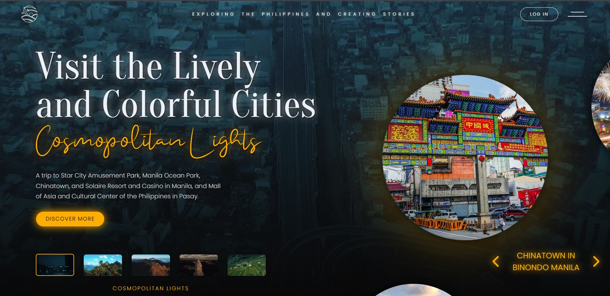
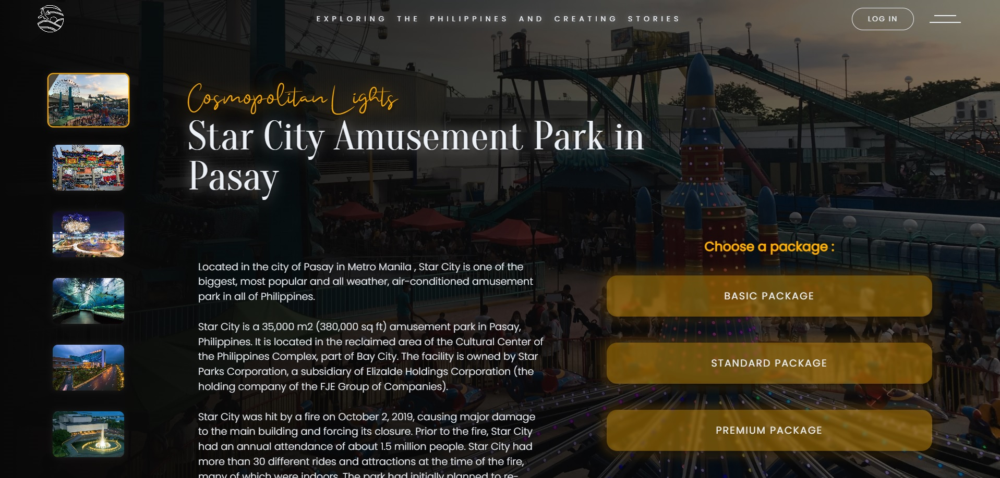
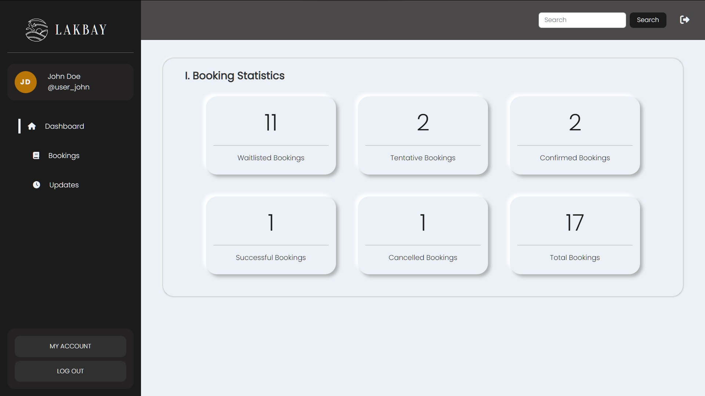
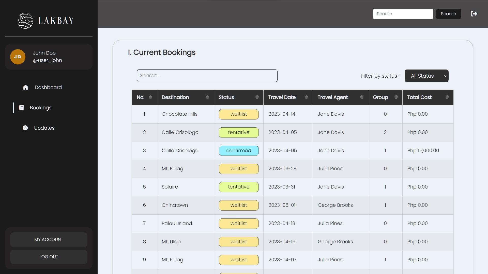

# Lakbay Travel Agency - Mini Project 2

## 
 <a href="https://lakbay.quendp.com/"> <---------- VIEW LIVE WEBSITE ----------></a> 

 

## 📷 Preview Image

  

 

  

 

  

 

  

 

---

## 📌 Key Features

- Fullstack website
- Responsive design
- Modern and Interactive UI
- Booking system
- Membership system (log in/log out)
- Role-based Authentication
- Form Validation on all forms
- Has Admin Dashboard (exclusive to admin account)
- Has Travel Agent Dashboard (exclusive to travel agent account)
- Has User Dashboard (exclusive to user account)

 

---

 

## 📝 Description

This is our group's submisssion to our coding bootcamp's capstone project. The brand "Lakbay" as well as the website's brief and functions are created by the developers for the sole purpose of this project. It is not a real company and does not operate in the real world. For the front-end, we utilized ReactJS with Vite, and for the backend, we used nodejs, creating this fullstack website.

 

### About the Brand

Lakbay is a Filipino travel agency which showcases various tourist spots in the Philippines and offers transportation and guiding services to customers. Their tours which lasts from half - 3 days focus on one primary destination (e.g. Puerto Princesa Underground River) and some nearby locations as secondary.

Their target audience is mainly young adventurous adults from both local and international. The clients want to have a website that feels modern, exquisite/elegant, trustworthy, safe, and emphasizes the beauty of the country.

 

### Website Features

The website should have the following features/sections:

- 5 main destination categories or themes (water, mountains, city, historical, nature)
- A page describing the main destinations (at least 3 in each theme) + secondary locations
- Log in and Sign Up membership system
- A tour booking system in each destination
- A member-exclusive account page
- A travel agent-exclusive dashboard
- An admin-exclusive dashboard
- A "Share your story" section in each destination showcasing the experiences of past customers instead of testimonials

 

---

 

## ⌛ Project Timeline

v1.0.0 - January 21, 2023 - Initialized project repository
v2.0.0 - March 4, 2023 - Finished front-end
v3.0.0 - March 27, 2023 - Finished back-end

 

---

 

## ⚙️ Tools and Languages

Frontend

- HTML
- CSS
- Bootstrap 5
- JavaScript
- React JS

Backend

- Node JS
- Express JS
- Sequelize

Version Control

- Git, GitHub,

 

---

 

## ❤️ Collaborators

- Quen Del Pilar (Lead)
- Nherwin Ostia
- CE Paguntalan
- Nick Anthony Escobido
- Radilyn Ramirez
- Roland Manalo
- JM Baldonado (Bootcamp Adviser)

 

---

 

### ❓ What's Next?

Here are some features we are looking to add in this project in the near future

- Bug fixes for Safari browsers
- Deactive animations option for low-end devices

 

---

 

### 💛 Acknowledgement

- [Manila City Skyline - Photo by David Milmont Unsplash](https://unsplash.com/@dmilmont?utm_source=unsplash&utm_medium=referral&utm_content=creditCopyText)
- [El Nido Palawan - Photo by Eibner Saliba Unsplash](https://unsplash.com/@zilch?utm_source=unsplash&utm_medium=referral&utm_content=creditCopyText)
- [Mount Pulag - Photo by Joanne Caselyn Unsplash](https://unsplash.com/@joannecaselyn?utm_source=unsplash&utm_medium=referral&utm_content=creditCopyText)
- [Calle Crisologo - Photo by Adrian Enriquez from Pixabay](https://pixabay.com/users/adrianenriquez-691469/?utm_source=link-attribution&utm_medium=referral&utm_campaign=image&utm_content=593843)
- [Cambulo Ifugao - Photo by AR from Unsplash](https://unsplash.com/@ar__?utm_source=unsplash&utm_medium=referral&utm_content=creditCopyText)
